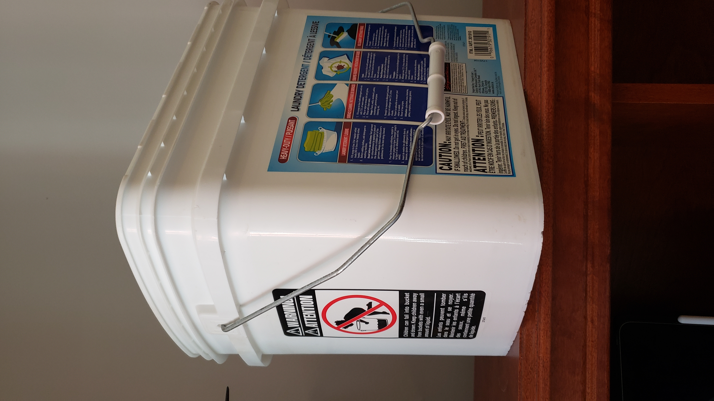
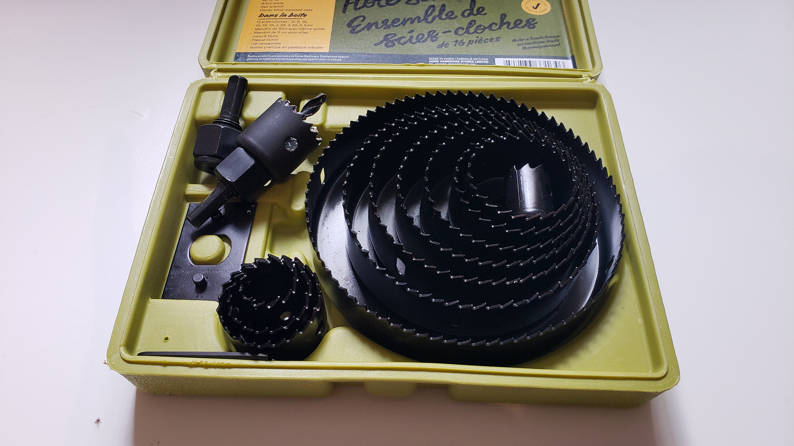
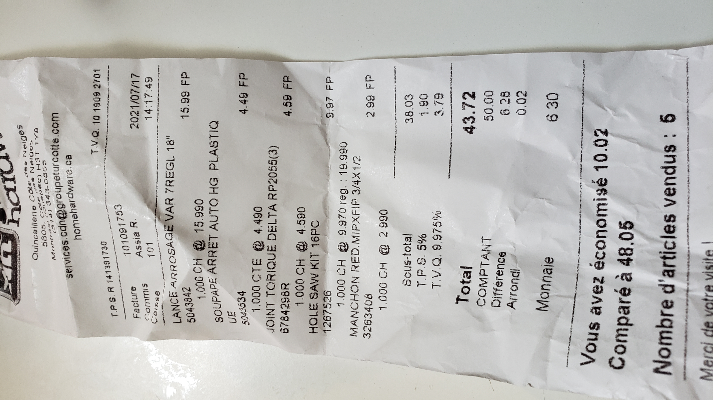

# Robot that shoots water into my mouth
This is the documentation I am writing for a bot that shoots water into my mouth. Originally, I was going to make this a robot that feeds me water, but I realized that was going to be extremely boring (useful, but boring). I still went ahead and made that, but I later focused on creating a robot that shoots water into my mouth. 
 
Link to Youtube video [here](https://www.youtube.com/watch?v=dQw3w9WgXcQ).

# Part 0: The original boring hydration bot
As I said, I originally just wanted to built some sort of elevated robot that could feed me water. This problem can be decomposed into 2 problems:
- Using/creating a water container
- Mounting a hose to it
- Using a motor to actuate the mechanism

This seems like a relatively simple problem and solution, but I still ran into a few problems. 

## Design
I've wanted to be more attentive to design, as a lot of times, it seemed that I jumped straight into CAD with Fusion359 and got stuck. I got pretty interested in Industrial Design and I recently purchased an Ipad Pro and use Concepts (inspired by Stuff Made Here).

I came up with quite a few ideas within Concepts of how water could be dispensed. Where should I place the water bottle? How tall is the whole robot? Where do I mount the electronics? How would the water flow? Does it go through a sort of valve? How many motors do I need? Through design, I managed to consider a lot of these problems.

I did research and looked at the way current water dispenser machines dispense water. 

## Conception

### Water Bottle
My original intuition was to simply create use a bottle, drill a hole into it, and be able to easily to mount the other components. As simple as that...right? Well not so easily.

Firstly, I needed to consider size. For me, I wanted the largest water bottle possible, since I didn't want to be constantly running around refilling my water bottle. I didn't want to settle for a bottle with a capacity of less than 1 liters.

I was also plannning on drilling a hole into the bottle, and since traditional water bottles have this angled pyramid shape towards the top, it becomes really hard to reach inside the bottle (which is an issue if I want to solidly mount the motors/mechanism onto the bottle itself.)

    

For this reason, I considered **2d printing** the water bottle, so I could make the bottle into the shape that I wanted, and easily mount the motor. 

I make this 2d design in Fusion 360, until I realized that PLA was not food safe...

    

Through this process I learned about how threading works from this [video](https://www.youtube.com/watch?v=aGWrFeu7Hv0&t=744s) made by Product Design Online (really helpful YouTube channel to learn Fusion360!) where I not only learned about how to make threads, but the fact that I needed to **add clearances based on my 3d printer's tolerance**. However, I didn't get to apply this knowledge because as I said, PLA isn't food safe. 

Now, PLA itself isn't necessarily toxic, but it is the fact that bacterias can form after the plastic's exposure to water for a long term. THis is what can be dangerous. Natural PLA is actually made from corn starch and general considered food safe. But PLA also breaks down after exposure to water for a long time. There's also the fact that our 2d printer hot ends usually contain dangerous chemicals. You can learn more by reading an All3DP article about [Is PLA Food Safe? - The Truth](https://all3dp.com/2/is-pla-food-safe-what-you-really-need-to-know/)

For this reason, I had to move away from 2d printing a water bucket. I ultimately ended up deciding using a bucket of landry detergent.

    

### Buying Tools and Cutting

Then, I bought some tools (a hole saw set) to drill a hole into this bucket. It was really straightforward drilling a hole into the bucket. 

    

During this time, I learned about different types of valves, because I wanted to develop a motorized mechanism that could control the flow of water with an Arduino (more on this later). I ended up going with a simple, cheap [shut-off valve](https://www.homehardware.ca/en/plastic-hosesprinkler-shut-off-valve/p/5043533?page=category%20page&rrec=true#ccode=14695) from the HomeHardware store. I bought some [O-rings](https://www.homehardware.ca/en/faucet-o-ring-replacement-for-delta-faucets/p/3303428) which exist to prevent water from leaking. To fix the sprinkler, I bought a [hex bushing](https://www.homedepot.ca/produit/sioux-chief-manchon-hex-1-mip-x-3-4-fip-barstock-nl-1-bg/1001002029). 

I was then looking for a long valve to put over my head. But then I realized it wouldn't work, and opted to buy a sort of garden-hose head (spent 15$ on it...)

Receipt

    

Now, I need to control the handle of the garden hose. So I ended up trying to mount.
I have some servo motors at home laying around (TG07) but unfortunately they weren't strong enough. So I bought some stepper motors that could turn infinitely. Used some tape and mounted it to the handle. Couldn't think of an easier mechanism since I had weight restrictions (I couldn't just strap in a nema17 lol). 

### Calculations
I wanted to do calculations to see how far the water would go. I got a few books, but I kind of got lazy.

TO COME BACK TO LATER
### Coding
This is just simple. We need to control the stepper motor. 
Check out the file here. 

